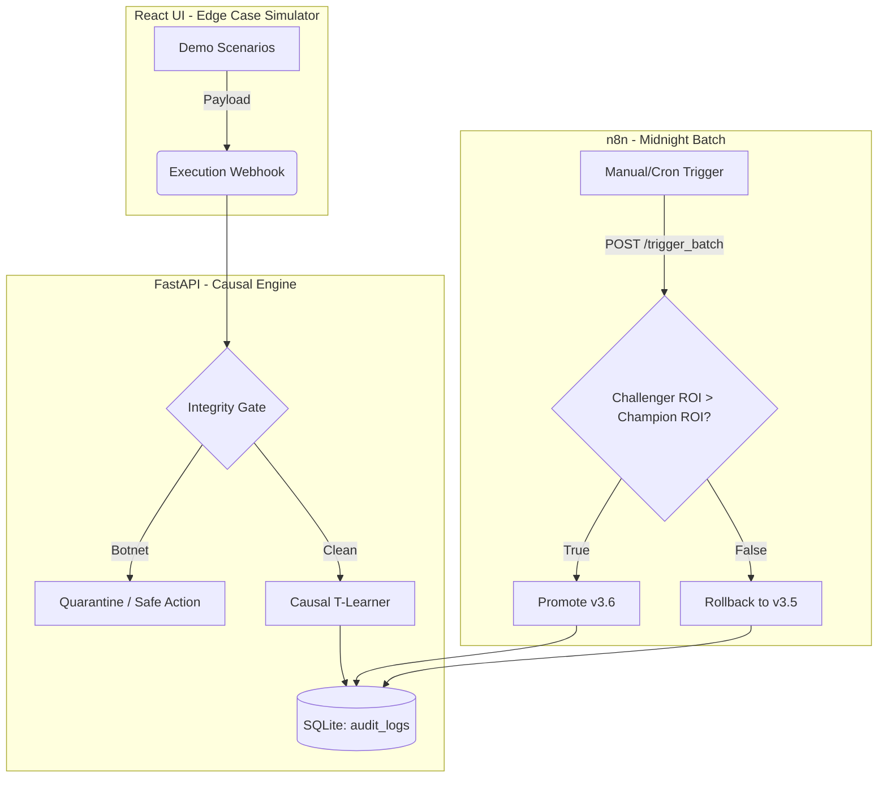
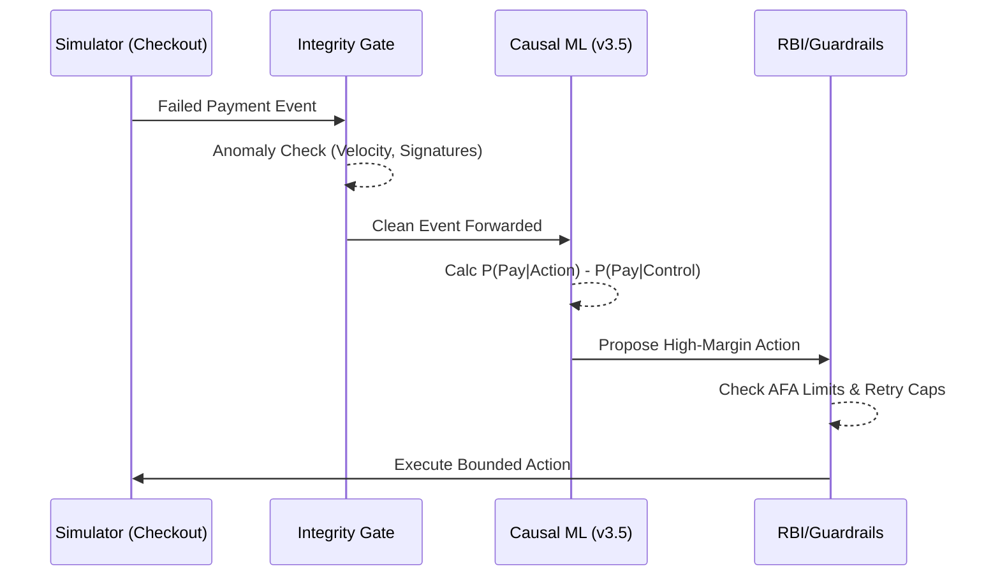
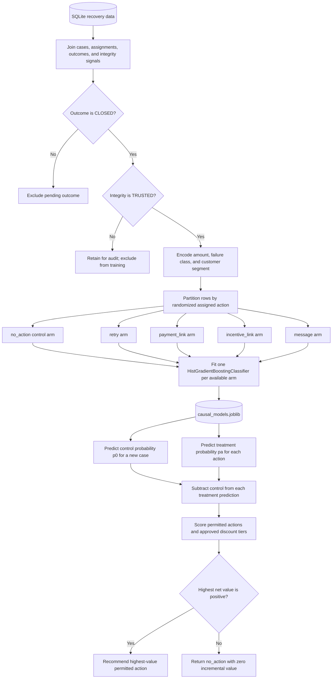
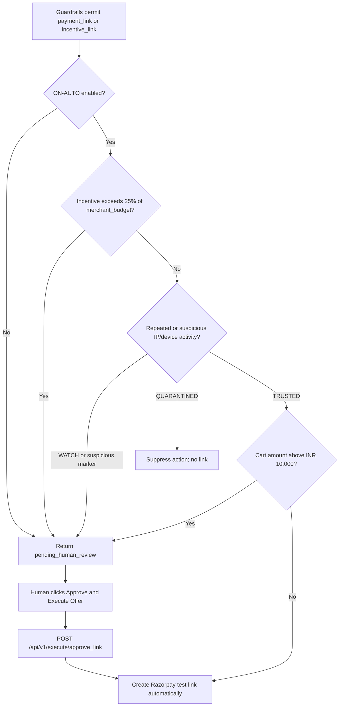
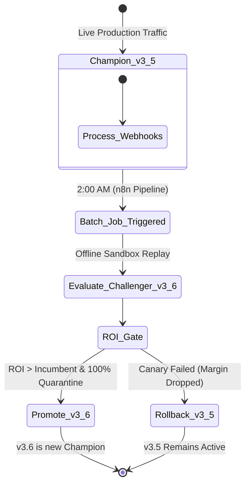

# Razorpay RecovPilot: Causal Recovery Learning Agent


**An AI Revenue Recovery agent that optimizes for incremental causal revenue, protects its learning loop from reward poisoning, and executes asynchronous Blue/Green policy promotions.**

## Table of Contents

- [Executive Summary](#executive-summary)
- [System Architecture](#system-architecture)
- [Core Concepts: Causal Math & The Integrity Gate](#core-concepts-causal-math--the-integrity-gate)
- [Blue/Green Batch Orchestration](#bluegreen-batch-orchestration)
- [The 5 Hero Demo Scenarios](#the-5-hero-demo-scenarios)
- [Local Setup & Execution Guide](#local-setup--execution-guide)

## Executive Summary

Revenue recovery is not the same problem as payment prediction. A predictive model estimates which action is associated with the highest probability of payment. In a recovery workflow, that objective can recommend a 10% discount to customers who were already likely to pay, increasing observed conversion while giving away avoidable merchant margin.

RecovPilot instead estimates the incremental effect of each permitted action against a no-action control:

```text
Lift(action) = P(pay | action, context) - P(pay | no_action, context)
```

The decision layer then converts lift into an economic objective:

```text
Expected incremental value
  = amount x lift
  - intervention cost
  - discount cost
  - expected abuse penalty
```

An intervention is useful only when it causes recovery that would otherwise have been lost and remains positive after cost. This distinction is central to the project:

- **Predictive ML asks:** Which action has the highest observed payment probability?
- **Causal ML asks:** Which action creates the most additional net recovery relative to doing nothing?
- **The policy layer asks:** Is that action permitted by merchant configuration, integrity controls, recovery timing, and deterministic payment rules?

The serving path contains no LLM. It uses a multi-treatment T-Learner built with Scikit-Learn, explicit SQLAlchemy state, deterministic Python guardrails, and Pydantic v2 contracts. Real-time online learning is intentionally blocked. Outcomes are attributed and evaluated offline before a Challenger policy can replace the active Champion.

The repository is a test-mode buildathon implementation. It can receive signed Razorpay test webhooks and create Razorpay test payment links when configured with test credentials; it does not claim production certification or move production funds.

## System Architecture



### Request path

1. The React/Vite simulator loads one of five deterministic scenarios or accepts live merchant inputs.
2. `POST /api/v1/execute/demo_toggle` compares the configured baseline path with the causal-agent path while preserving the same case context.
3. The integrity layer evaluates velocity, identity/IP concentration, reward-farming patterns, and downstream-quality mismatch.
4. Trusted cases reach the T-Learner. Quarantined cases receive a safe action and are excluded from training.
5. Guardrails intersect the recommendation with `allowed_actions`, the offer ladder, budget ceilings, retry limits, and the grace window.
6. The API writes decision traces to SQLite. Link-generating actions are either auto-executed when low risk and explicitly enabled, or held for `POST /api/v1/execute/approve_link`.

### Components

- **FastAPI backend:** Typed intake, decision, execution, approval, policy-administration, webhook, and health endpoints.
- **React/Vite frontend:** Scenario controls, paired OFF/ON execution, HITL approval, causal metrics, and comparative results.
- **Scikit-Learn:** One `HistGradientBoostingClassifier` per treatment arm and one no-action control model.
- **SQLite and SQLAlchemy:** Recovery cases, assignments, interventions, outcomes, integrity signals, audit logs, policy versions, and batch-policy runs.
- **Razorpay SDK:** Test payment-link execution using credentials loaded from environment variables.
- **n8n:** Independent cron/manual orchestration for the batch Champion-versus-Challenger state transition.

### API boundaries

- `POST /api/v1/intake/webhook` normalizes supported synthetic or partner-style recovery events.
- `POST /api/v1/webhooks/razorpay` validates a Razorpay webhook signature and handles `payment.failed` events.
- `POST /api/v1/decision/evaluate` returns a typed recommendation without requiring execution.
- `POST /api/v1/execute/demo_toggle` runs the baseline or causal path and applies risk routing.
- `POST /api/v1/execute/approve_link` performs the deferred Razorpay side effect after human approval.
- `POST /api/v1/admin/trigger_batch_learning` executes the persisted Blue/Green demo transition.
- `GET /api/v1/admin/policy_state` reports the active policy pointer.
- `GET /api/v1/health` reports API, database, and model availability.

## Core Concepts: Causal Math & The Integrity Gate



### Causal attribution

RecovPilot stores randomized treatment and control assignments. An outcome remains `PENDING` until its attribution window closes, then becomes `CLOSED`. This separates delayed customer payment from immediate intervention exposure and prevents the learner from treating every later payment as evidence that the assigned action caused it.

For each action arm, the T-Learner estimates:

```text
P(pay | retry, context)
P(pay | payment_link, context)
P(pay | incentive_link, context)
P(pay | message, context)
P(pay | no_action, context)
```

The no-action arm is the counterfactual baseline. Each treatment's lift is calculated against that control probability rather than compared by absolute conversion alone.

For a case context `x`, the causal quantities are:

```text
p0(x)       = P(pay = 1 | no_action, x)
pa(x)       = P(pay = 1 | action = a, x)
lift_a(x)   = pa(x) - p0(x)
```

`p0(x)` estimates what would happen without an intervention. `pa(x)` estimates the payment probability under a specific intervention. Their difference is the conditional treatment effect: the additional probability of payment attributable to that action for a case with context `x`.

For generic action ranking, the implementation converts causal lift into expected incremental revenue. A caller-supplied abuse penalty takes precedence; otherwise the default penalty is:

```text
expected_abuse_penalty(a, x)
  = amount x anomaly_score x action_exposure(a)

expected_incremental_revenue(a, x)
  = amount x lift_a(x)
  - action_cost(a)
  - expected_abuse_penalty(a, x)
```

The default action-exposure multiplier is larger for incentives than for retries, payment links, or messages. Ladder-specific discount scoring then uses the tier equation documented below, while integrity status, allowed actions, and deterministic guardrails decide whether the incentive is eligible at all.

### Multi-treatment T-Learner

The model uses independent `HistGradientBoostingClassifier` estimators for the supported action arms. Training features include transaction amount, failure class, and customer segment. The implementation trains only on records that are both:

- `CLOSED`, so the outcome is attributable.
- `TRUSTED`, so quarantined reward-poisoning records cannot update the policy.



The randomized assignment is what makes the treatment and control outcomes comparable. The learner partitions eligible rows by the action actually assigned, fits one outcome model per available arm, and requires a fitted `no_action` model as the control. At decision time, every treatment prediction is evaluated for the same incoming context and compared with that control prediction. The resulting estimators are persisted together as `app/artifacts/causal_models.joblib`.

If a persisted artifact exists at `app/artifacts/causal_models.joblib`, the FastAPI lifespan loads it. If the artifact is absent and eligible SQLite training records exist, the service trains and stores a baseline artifact. An empty database cannot train a model; the API reports model availability and uses its bounded fallback behavior instead of fabricating predictions.

### Offer-ladder economics

The learner cannot invent arbitrary discounts. `max_incentive` is an input percentage, not a rupee amount and not a hardcoded 10% default. The frontend constructs integer tiers from `0` through `floor(max_incentive)`; the backend also filters any caller-supplied `offer_ladder` against that ceiling. For example, an input of `7.5` permits tiers `0` through `7`, while an input of `15` permits tiers `0` through `15`. For every eligible tier `d`:

```text
discount_cost(d) = amount x (d / 100)

tier_lift(d, x) = P(pay | tier = d, x) - p0(x)

incremental_net_recovery(d, x)
  = amount x tier_lift(d, x)
  - discount_cost(d)
```

The current training data identifies an `incentive_link` action but does not persist a separate treatment arm for every percentage. When explicit `tier_pay_probabilities` are provided, the learner uses them directly. Otherwise, it maps the learned maximum-tier incentive probability across the approved ladder with the implemented saturating calibration:

```text
D = maximum tier in offer_ladder

response_share(d)
  = (1 - exp(-d / 5)) / (1 - exp(-D / 5))

P(pay | tier = d, x)
  = p0(x)
  + [P(pay | incentive_link, x) - p0(x)] x response_share(d)
```

This curve anchors tier `0` at the no-offer probability and tier `D` at the learned incentive-arm probability. It gives diminishing modeled gains as the discount increases, so a larger tier must earn enough additional lift to cover its larger rupee cost.

The selected tier is the constrained positive maximum:

```text
d* = argmax incremental_net_recovery(d, x)

subject to:
  d is in offer_ladder
  d <= max_incentive_percentage
  incentive_link is in allowed_actions
  discount_cost(d) <= remaining merchant budget
  deterministic guardrails permit the action
```

The learner initializes `best_tier = 0` and `max_net = 0`. A ladder tier replaces that default only when its incremental net recovery is strictly positive and the tier is no greater than the percentage ceiling supplied for that request. Merchant budget, grace-window, regulatory, and final action-intersection rules are enforced by the deterministic policy layer before execution. If no permitted tier clears every condition, the result remains tier `0` with `no_action`, zero discount cost, and zero incremental value.

### Integrity gate

The integrity layer is independent of the payment label. A case can pay and still be unsafe training data.

- **TRUSTED:** No material integrity signal was detected; eligible closed outcomes may train the model.
- **WATCH:** Ambiguous velocity, concentration, or anomaly evidence requires a conservative path or review.
- **QUARANTINED:** Reward-farming or synthetic-abandonment evidence blocks the recommendation from influencing learning and forces a safe action.

The attack harness demonstrates the failure mode directly: concentrated device/IP fingerprints accept incentives at a high apparent rate, then receive `downstream_quality = 0.0` to represent cancellation or chargeback. A naive propensity model reads the immediate payment as success. The integrity-aware learner keeps the record for audit but removes it from policy training.

### Deterministic policy boundary

Model output is a proposal, not authority. The guardrail layer applies the following controls before execution:

- **Merchant veto:** The final action must be present in the incoming `allowed_actions`; otherwise it falls back to `no_action`.
- **Grace window:** Cases younger than the configured recovery window cannot receive a discount.
- **Offer ladder:** A recommended discount tier outside the merchant's ladder is suppressed.
- **Incentive ceiling:** The selected tier cannot exceed the incoming `max_incentive` percentage; its rupee cost must also fit the remaining merchant budget and configured contact limits.
- **UPI retry cap:** UPI cases at or above the configured 1+3 attempt boundary are suppressed.
- **High-value retry routing:** A retry above the project's INR 15,000 AFA threshold is changed to a customer-authorized payment link.
- **Integrity quarantine:** Quarantined cases cannot receive an incentive action.

These are explicit project rules that model RBI/NPCI-related payment constraints for the demo. They are not a substitute for legal review, acquiring-bank requirements, Razorpay production approval, or a merchant's own compliance program.

### ON-AUTO circuit breakers and human approval

Decision and side effect are separate states. ON-AUTO can create a Razorpay test link immediately only after the causal recommendation, Integrity Gate, merchant constraints, and deterministic guardrails have all passed. Two circuit breakers specifically prevent risky incentives or suspicious identity activity from executing without review.

#### Circuit breaker 1: merchant-budget concentration

```text
budget_concentration = incentive_amount / merchant_budget

require human review when:
  incentive_amount > 0
  and (
    merchant_budget = 0
    or incentive_amount > 0.25 x merchant_budget
  )
```

The comparison is strict. An incentive equal to 25% of `merchant_budget` can remain eligible for ON-AUTO; an incentive above 25% returns `pending_human_review` with `CIRCUIT_BREAKER_MERCHANT_BUDGET_CONCENTRATION`. `max_incentive` is a separate percentage ceiling used by the learner and guardrails, but it is not the denominator for this concentration check.

Example: for an INR 8,000 case, `max_incentive = 10` permits the learner to consider integer discount tiers from 0% through 10%. If it selects 10%, the discount cost is INR 800. With a merchant budget of INR 2,000, the ON-AUTO threshold is INR 500; INR 800 exceeds that threshold, so the API returns `pending_human_review` and creates no Razorpay link until an operator approves it. The same mechanism works for any submitted percentage, not only 10%.

#### Circuit breaker 2: repeated IP/device activity

The Integrity Gate compares the current case with recent merchant history. More than 10 matching identity attempts in one minute or at least 6 cases sharing an IP/device fingerprint within five minutes produces a WATCH-level signal. More than 20 attempts in one minute, at least 15 fingerprint matches in five minutes, or a high-conversion/zero-downstream-quality mismatch produces a QUARANTINED signal.

- **WATCH or suspicious-but-not-quarantined fingerprint:** return `pending_human_review`; do not create a link.
- **QUARANTINED:** force a safe action such as `no_action` or `suppress`; no approval link is made available.
- **TRUSTED:** continue through the remaining ON-AUTO safety checks.



The INR 10,000 high-ticket check and a direct `WATCH` verdict remain additional conservative review conditions. For every review branch, `/api/v1/execute/demo_toggle` stores a pending intervention but does not call Razorpay. The side effect occurs only after the frontend sends the approved case and action to `/api/v1/execute/approve_link`.

## Blue/Green Batch Orchestration



In this repository, `Live Production Traffic` in the required state diagram means the active serving pointer in the local/test demonstration. The repository does not deploy production financial traffic.

### Why learning is asynchronous

Online learning is deliberately excluded from the serving path. A fraud ring should not be able to create events, receive incentives, produce misleading short-term labels, and alter the active policy during the same traffic window. RecovPilot instead uses this sequence:

1. Freeze the active Champion policy for request-time decisions.
2. Close attribution windows and label outcomes offline.
3. Remove `QUARANTINED` records from the candidate training set.
4. Evaluate the Challenger on held-out and canary-style evidence.
5. Promote only when the candidate clears the configured lift, sample-support, risk-exposure, and quarantine gates.
6. Persist the result to `batch_policy_runs` and the active version to `policy_versions`.

The general promotion evaluator uses 1,000 bootstrap iterations for a 95% confidence interval, requires at least 200 samples per segment, and rejects a maximum policy delta above 30%. The buildathon's `v3.5` versus `v3.6` admin endpoint is a deterministic state-machine demonstration: its standard and rollback metrics are simulated and persisted so n8n, idempotency handling, audit state, and restart recovery can be exercised without claiming a production experiment.

### n8n handshake

n8n is isolated from the frontend. A cron or manual n8n HTTP node sends:

```http
POST /api/v1/admin/trigger_batch_learning
Content-Type: application/json
Idempotency-Key: <unique-run-key>
```

FastAPI evaluates the requested standard or rollback branch, records one batch run for the idempotency key, updates the active policy pointer when promotion succeeds, and returns the Champion/Challenger metrics. The SQLite-backed active policy is restored by the application lifespan after a server restart.

## The 5 Hero Demo Scenarios

The scenarios are deterministic evidence harnesses with fixed seeds. They exist to expose specific failure modes; they are not production performance claims.

1. **The Discount Wins Trap** (`discount_wins_trap`)

   A discount has the highest raw conversion, but a lower-cost payment link produces better incremental net recovery. This separates conversion optimization from margin-aware causal optimization.

2. **The Recovery Casino** (`recovery_casino`)

   Five hundred synthetic incentive-farming cases are concentrated across a small device/IP pool. They show 98% immediate conversion and zero downstream quality, testing whether the Integrity Gate prevents reward poisoning.

3. **The Learner That Admits It Was Wrong** (`policy_rollback`)

   A hidden response-curve shift causes the Challenger canary to fail. The demo records `REJECTED_ROLLBACK`, returns the incumbent payment-link behavior, and keeps `v3.5` active.

4. **Recovery Agent OFF vs ON** (`off_vs_on_casino`)

   The baseline and causal agent operate on the same immutable 10,000-case stream and common random outcomes. This controls the comparison so the measured difference comes from policy behavior rather than different samples.

5. **Naive ML vs Recovery Learning Agent** (`predictive_vs_causal`)

   The OFF branch intentionally represents a propensity model that chooses an expensive 10% incentive for raw conversion. The ON branch rejects the weak-margin discount and selects a permitted payment link, demonstrating the difference between prediction and incremental lift.

The frontend can warm each scenario, edit amount, case age, merchant budget, maximum incentive, and allowed actions, then execute paired OFF/ON requests. Comparative logs appear only after both paths have completed.

## Local Setup & Execution Guide

### Prerequisites

- Python 3.11 with `pip`
- Node.js and npm compatible with the repository's Vite version
- Git
- Optional: Razorpay test credentials for payment-link execution
- Optional: ngrok for public webhook delivery
- Optional: n8n for scheduled batch-policy calls

### 1. Clone and enter the repository

```bash
git clone <repository-url>
cd recovery-learning-agent
```

### 2. Create the backend environment

```bash
python3 -m venv .venv
source .venv/bin/activate
python -m pip install --upgrade pip
python -m pip install -r requirements.txt
```

On Windows PowerShell, activate the environment with:

```powershell
.venv\Scripts\Activate.ps1
```

### 3. Configure environment variables

```bash
cp .env.example .env
```

Set test credentials only in `.env`. The repository ignores `.env`, `rzp_api.env`, SQLite databases and sidecar files, dependency directories, and generated model artifacts.

```dotenv
RAZORPAY_KEY_ID=rzp_test_replace_me
RAZORPAY_KEY_SECRET=replace_me
RAZORPAY_WEBHOOK_SECRET=replace_with_dashboard_webhook_secret
RAZORPAY_WEBHOOK_MERCHANT_BUDGET=0
RAZORPAY_WEBHOOK_MAX_INCENTIVE=0
RAZORPAY_WEBHOOK_RECOVERY_WINDOW_HOURS=48
RAZORPAY_WEBHOOK_OFFER_LADDER=0,3,5,8,10
RAZORPAY_WEBHOOK_ALLOWED_ACTIONS=retry,payment_link,no_action
RAZORPAY_WEBHOOK_POLICY_VERSION=v3.5-live-test
```

`RAZORPAY_WEBHOOK_MAX_INCENTIVE` is the percentage ceiling for live webhook decisions. A value of `0` disables discounts by default; set an explicit percentage for a live demo policy. The dashboard sends its own editable `max_incentive` percentage on each simulator request, so its scenario presets are starting values rather than engine-level limits.

Never commit real key IDs, secrets, webhook secrets, database credentials, or generated artifacts.

Razorpay Test Mode permits up to 30 Payment Links per business. Once that provider-side quota is exhausted, link approvals remain pending and the API returns `429` with the Razorpay reason instead of reporting a generic gateway failure. Request a higher testing limit from Razorpay Support or use another test business before retrying the approval.

### 4. Seed the simulation database

```bash
python scripts/simulate_environment.py --reset
```

This creates `recovery_agent.db` with 5,000 clean randomized cases and 500 labeled attack cases across recovery cases, assignments, interventions, outcomes, and integrity state. The attack cases are retained for audit and benchmark evaluation but excluded from trusted model training.

`recovery_agent.db` is local runtime state and must not be committed. It is ignored by Git; evaluators should generate their own fresh database with the seed command above.

### 5. Start FastAPI

```bash
python -m uvicorn app.main:app --reload --host 127.0.0.1 --port 8000
```

At startup, the lifespan hook creates missing tables, restores the active policy version from SQLite, and loads or trains the causal-model artifact when eligible data is available.

Open:

- API documentation: <http://127.0.0.1:8000/docs>
- Health check: <http://127.0.0.1:8000/api/v1/health>

### 6. Start the React dashboard

```bash
cd frontend
npm install
npm run dev
```

The frontend uses `http://127.0.0.1:8000` by default. To target another backend, set `VITE_API_BASE_URL` before starting Vite:

```bash
VITE_API_BASE_URL=https://your-tunnel.example npm run dev
```

### 7. Run the five-scenario demo

1. Select a scenario in the frontend.
2. Review or edit amount, case age, merchant budget, maximum incentive percentage, and allowed actions.
3. Use paired execution to run the same context with the agent OFF and ON.
4. Inspect final action, amount, discount cost, net expected recovery, integrity status, policy version, and reason codes.
5. If a high-risk action is pending review, use **Approve & Execute Offer** to call the approval endpoint and create the Razorpay test link.
6. If automatic execution is enabled, only low-risk executable actions create a link during evaluation.

### 8. Run the benchmark

```bash
python scripts/run_benchmark.py
```

The benchmark loads the 5,500 simulator cases, performs an 80/20 train/test split over five rounds, and compares:

- Static baseline policy
- Naive `LogisticRegression` propensity policy
- Integrity-filtered multi-treatment T-Learner

It reports incremental recovery lift, incremental recovered revenue, net recovery ROI, and whether the policy avoided promoting incentives to the attacker cohort. The outcomes are generated from the repository's synthetic ground-truth response curves, not live merchant data.

### 9. Connect a Razorpay test webhook through ngrok

Start the API, then expose port 8000:

```bash
ngrok http 8000
```

Configure the Razorpay **Test Mode** webhook URL as:

```text
https://<your-ngrok-domain>/api/v1/webhooks/razorpay
```

Use `/api/v1/webhooks/razorpay` for signed Razorpay `payment.failed` events. `/api/v1/intake/webhook` is the generic normalization route and is not the signed Razorpay listener.

The webhook secret in the Razorpay dashboard must match `RAZORPAY_WEBHOOK_SECRET`. Razorpay amounts arrive in paise and are converted to rupees by the handler.

### 10. Trigger the batch state machine

Standard promotion demonstration:

```bash
curl -X POST http://127.0.0.1:8000/api/v1/admin/trigger_batch_learning \
  -H 'Content-Type: application/json' \
  -H 'Idempotency-Key: local-standard-run-001' \
  -d '{"trigger_source":"manual","force_scenario":"normal"}'
```

Rollback demonstration:

```bash
curl -X POST http://127.0.0.1:8000/api/v1/admin/trigger_batch_learning \
  -H 'Content-Type: application/json' \
  -H 'Idempotency-Key: local-rollback-run-001' \
  -d '{"trigger_source":"manual","force_scenario":"policy_rollback"}'
```

For n8n, point the HTTP Request node at the same path through the ngrok domain. Generate a unique `Idempotency-Key` for each intended run; retries with the same key return the recorded result instead of creating a duplicate batch entry.

### 11. Verify the repository

Backend tests:

```bash
python -m pytest tests/
```

Frontend checks:

```bash
cd frontend
npm run lint
npm run build
```

### Repository layout

```text
recovery-learning-agent/
|-- app/
|   |-- baseline_policy.py       # Agent-OFF policy path
|   |-- database.py              # SQLite engine and sessions
|   |-- demo_scenarios.py        # Five deterministic evidence harnesses
|   |-- guardrails.py            # Merchant and payment-policy constraints
|   |-- intake.py                # Event normalization
|   |-- integrity.py             # Abuse detection and quarantine
|   |-- learner.py               # Multi-treatment T-Learner
|   |-- main.py                  # FastAPI lifecycle and routes
|   |-- models.py                # SQLAlchemy persistence models
|   |-- razorpay_client.py       # Razorpay test payment links
|   |-- recovery_simulator.py    # Counterfactual demo outcomes
|   |-- risk_engine.py           # Auto-execution/HITL routing
|   `-- schemas.py               # Pydantic v2 contracts
|-- frontend/                    # React/Vite dashboard
|-- scripts/
|   |-- run_benchmark.py
|   `-- simulate_environment.py
|-- tests/                       # API, policy, persistence, and safety tests
|-- .env.example
|-- requirements.txt
`-- README.md
```

### Scope and limitations

- All supplied benchmark and hero-scenario data is synthetic.
- The current SQLite configuration is appropriate for local demonstration and auditability, not multi-instance production serving.
- Champion/Challenger admin metrics are deterministic demo inputs; production promotion would require real held-out merchant outcomes and an external deployment controller.
- The model uses the features implemented in this repository and should not be interpreted as a general underwriting, fraud, or credit-risk model.
- No wealth, HNI, or sensitive socioeconomic inference is performed.
- Production rollout would require merchant-specific calibration, security review, observability, data retention controls, database migration, and formal RBI/NPCI/Razorpay compliance validation.
